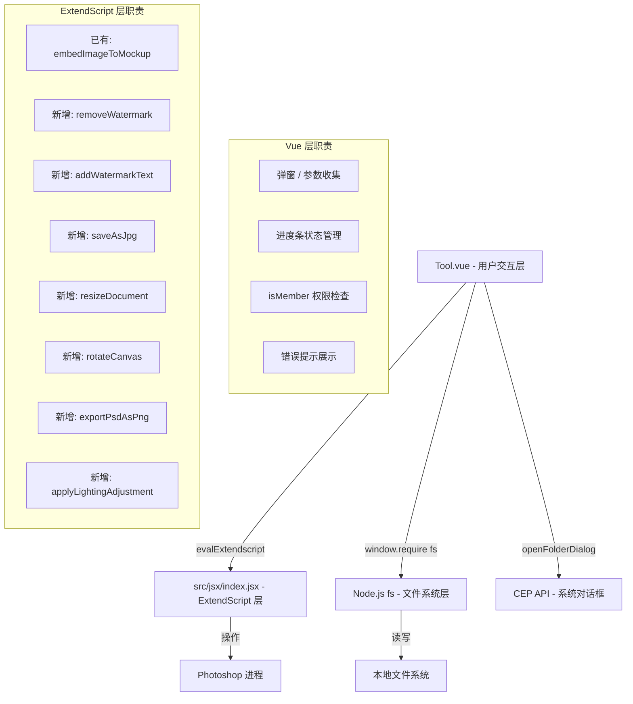

# Design Document: Tool Page Tools

## Overview

本设计文档描述 `Tool.vue` 页面中 9 个工具的完整实现方案。工具分为两类：

- **免费工具（5 个）**：清除水印、添加水印、一键转 JPG、尺寸规范化、画布旋转
- **会员工具（4 个）**：一键样机替换、批量导出图包、批量智能重命名、光影自动匹配

所有工具遵循统一的交互模式：Vue 层负责 UI 交互（弹窗、参数收集、进度展示），ExtendScript 层负责 Photoshop 操作，Node.js fs 模块负责文件系统批量操作。

---

## Architecture



**数据流**：

1. 用户点击工具卡片 → `handleTool(item)` 按 `item.id` 分发
2. 权限检查（会员工具）→ 非会员弹出升级提示，会员继续
3. 弹窗收集参数 → 调用 ExtendScript 或 Node.js fs
4. 结果回调 → 更新进度/显示提示

---

## Components and Interfaces

### Tool.vue 结构扩展

`handleTool` 方法按 id 分发到各工具处理函数：

```javascript
handleTool(item) {
  const handlerMap = {
    1:   this.handleRemoveWatermark,
    2:   this.handleAddWatermark,
    3:   this.handleSaveAsJpg,
    4:   this.handleResizeDocument,
    5:   this.handleRotateCanvas,
    101: this.handleMockupReplace,
    102: this.handleBatchExport,
    103: this.handleBatchRename,
    104: this.handleLightingMatch,
  };
  const handler = handlerMap[item.id];
  if (handler) handler.call(this);
}
```

### 会员权限检查

所有会员工具（id >= 100）在执行前调用统一检查：

```javascript
checkMember() {
  if (!this.isMember) {
    this.$emit('handleRecharge'); // 触发父组件打开充值弹窗
    return false;
  }
  return true;
}
```

### CEP 文件夹选择

使用 `cep-interface` 的 `openFolderDialog`：

```javascript
import * as cepInterface from 'cep-interface';

function selectFolder(title) {
  return cepInterface.openFolderDialog(title);
  // 返回路径字符串，用户取消时返回 null 或空字符串
}
```

### ExtendScript 调用约定

所有 JSX 函数通过 `cepInterface.evalExtendscript()` 调用，返回 Promise：

```javascript
import * as cepInterface from 'cep-interface';

// 调用示例
const result = await cepInterface.evalExtendscript(`functionName("${param}")`);
// result 为字符串，约定：'true' 表示成功，'false:错误信息' 表示失败
```

### 进度条状态（批量操作）

```javascript
data() {
  return {
    progress: {
      visible: false,   // 是否显示进度条
      current: 0,       // 当前处理数
      total: 0,         // 总数
      errors: []        // 失败记录 [{file, reason}]
    }
  }
}
```

---

## Data Models

### 工具定义

```javascript
// Tool item
{
  id: Number,       // 工具唯一 ID
  name: String,     // 显示名称
  icon: String      // Element UI icon class
}
```

### 尺寸规范化参数

```javascript
{
  targetWidth: Number | null,   // 目标宽度（px），null 表示按比例计算
  targetHeight: Number | null,  // 目标高度（px），null 表示按比例计算
  origWidth: Number,            // 原始宽度（从 PS 读取）
  origHeight: Number            // 原始高度（从 PS 读取）
}
```

等比例计算逻辑（纯函数，可单独测试）：

```javascript
function calcProportionalSize(origW, origH, inputW, inputH) {
  if (inputW && !inputH) return { w: inputW, h: Math.round((origH * inputW) / origW) };
  if (inputH && !inputW) return { w: Math.round((origW * inputH) / origH), h: inputH };
  return { w: inputW, h: inputH };
}
```

### 批量导出配置

```javascript
{
  srcFolder: String,          // 源文件夹路径
  destFolder: String,         // 目标文件夹路径
  sizes: Number[]             // 导出尺寸列表，默认 [800, 1500, 2000]
}
```

导出文件名生成（纯函数）：

```javascript
function buildExportFileName(baseName, size) {
  return `${baseName}_${size}px.png`;
}
```

### 批量重命名配置

```javascript
{
  folder: String,       // 文件夹路径
  prefix: String,       // 前缀
  suffix: String,       // 后缀
  startIndex: Number    // 起始序号，默认 1
}
```

重命名文件名生成（纯函数）：

```javascript
function buildRenameFileName(prefix, index, suffix, ext) {
  return `${prefix}${index}${suffix}${ext}`;
}
```

### ExtendScript 新增函数签名

```javascript
// 清除水印（内容识别填充）
function removeWatermark() → Boolean

// 添加文字水印
function addWatermarkText(text) → Boolean

// 另存为 JPG
function saveAsJpg(folderPath, fileName) → Boolean

// 调整文档尺寸
function resizeDocument(width, height) → Boolean

// 旋转画布
function rotateCanvas(angle) → Boolean

// 导出 PSD 为指定尺寸 PNG
function exportPsdAsPng(psdPath, destPath, size) → Boolean

// 应用光影调整图层
function applyLightingAdjustment() → Boolean
```

---

## Correctness Properties

_A property is a characteristic or behavior that should hold true across all valid executions of a system — essentially, a formal statement about what the system should do. Properties serve as the bridge between human-readable specifications and machine-verifiable correctness guarantees._

### Property 1: 空白水印文字被拒绝

_For any_ 由纯空白字符（空格、制表符、换行符等）组成的字符串，将其作为水印文字提交时，系统应阻止提交且不调用 ExtendScript，同时显示"水印文字不能为空"提示。

**Validates: Requirements 2.4**

---

### Property 2: 成功提示包含保存路径

_For any_ 合法的文件夹路径字符串，当 JPG 保存成功后，显示的成功提示消息应包含该路径字符串。

**Validates: Requirements 3.4**

---

### Property 3: 等比例尺寸计算正确性

_For any_ 正整数原始宽高 (origW, origH) 和任意单边正整数输入（只填宽度或只填高度），`calcProportionalSize` 计算出的结果应满足：`result.w / result.h ≈ origW / origH`（误差在 1px 以内）。

**Validates: Requirements 4.3**

---

### Property 4: 非正整数尺寸输入被拒绝

_For any_ 非正整数值（负数、零、小数、非数字字符串），将其作为宽度或高度输入时，系统应阻止提交并显示提示，不调用 ExtendScript。

**Validates: Requirements 4.4**

---

### Property 5: 超范围角度输入被拒绝

_For any_ 不在 [-360, 360] 范围内的数值，将其作为自定义旋转角度提交时，系统应阻止提交并显示提示，不调用 ExtendScript。

**Validates: Requirements 5.4**

---

### Property 6: PSD 文件过滤正确性

_For any_ 包含任意扩展名文件名的列表，经过 PSD 文件过滤后，结果列表中的每个文件名都应以 `.psd`（大小写不敏感）结尾，且原列表中所有 `.psd` 文件都应出现在结果中。

**Validates: Requirements 6.3**

---

### Property 7: 批量完成提示包含正确数量

_For any_ 数量为 N 的 PSD 文件列表（全部处理成功），完成后显示的提示消息应包含数字 N。

**Validates: Requirements 6.7**

---

### Property 8: 导出文件名格式正确性

_For any_ 合法的文件基础名（不含扩展名）和正整数尺寸值，`buildExportFileName(baseName, size)` 生成的文件名应符合 `{baseName}_{size}px.png` 格式。

**Validates: Requirements 7.5**

---

### Property 9: 重命名文件名格式正确性

_For any_ 前缀字符串、后缀字符串、正整数序号和文件扩展名，`buildRenameFileName(prefix, index, suffix, ext)` 生成的文件名应符合 `{prefix}{index}{suffix}{ext}` 格式，且原扩展名被完整保留。

**Validates: Requirements 8.5**

---

## Error Handling

### 统一错误处理模式

所有工具遵循以下错误处理约定：

| 错误类型                | 来源                    | 处理方式                                         |
| ----------------------- | ----------------------- | ------------------------------------------------ |
| 无活动文档              | ExtendScript 返回错误   | `$message.warning('请先在 PS 中打开一个文档')`   |
| 无选区                  | ExtendScript 返回错误   | `$message.warning('请先在 PS 中圈选目标区域')`   |
| 用户取消弹窗/文件夹选择 | 返回 null/空字符串      | 静默退出，不显示任何提示                         |
| 输入验证失败            | Vue 层校验              | `$message.warning(具体提示)`                     |
| ExtendScript 运行时错误 | evalExtendscript reject | `$message.error('操作失败：' + errorMsg)`        |
| 批量操作部分失败        | 循环中捕获              | 记录到 `progress.errors`，继续处理，最终汇总展示 |
| 非会员访问会员工具      | isMember 检查           | `$emit('handleRecharge')` 打开充值弹窗           |

### ExtendScript 错误约定

JSX 函数统一返回字符串：

- 成功：`'true'`
- 失败：`'false:错误描述'`

Vue 层解析：

```javascript
function parseJsxResult(result) {
  if (result === 'true') return { ok: true };
  const msg = result.startsWith('false:') ? result.slice(6) : result;
  return { ok: false, msg };
}
```

---

## Testing Strategy

### 单元测试（Jest + Vue Test Utils）

针对纯函数逻辑编写单元测试：

- `calcProportionalSize(origW, origH, inputW, inputH)` — 等比例计算
- `buildExportFileName(baseName, size)` — 导出文件名生成
- `buildRenameFileName(prefix, index, suffix, ext)` — 重命名文件名生成
- `parseJsxResult(result)` — ExtendScript 结果解析
- PSD 文件过滤逻辑

针对 Vue 组件交互编写 example 测试（mock `cep-interface`）：

- 非会员点击会员工具 → 触发 `handleRecharge` 事件
- 用户取消文件夹选择 → 不调用 evalExtendscript
- 无选区/无文档错误 → 显示正确提示

### 属性测试（fast-check）

使用 [fast-check](https://github.com/dubzzz/fast-check) 对以上 9 个 Correctness Properties 编写属性测试，每个属性最少运行 100 次。

测试标注格式：

```javascript
// Feature: tool-page-tools, Property 3: 等比例尺寸计算正确性
test('calcProportionalSize preserves aspect ratio', () => {
  fc.assert(
    fc.property(
      fc.integer({ min: 1, max: 10000 }),
      fc.integer({ min: 1, max: 10000 }),
      fc.integer({ min: 1, max: 10000 }),
      (origW, origH, inputW) => {
        const result = calcProportionalSize(origW, origH, inputW, null);
        const ratio = result.w / result.h;
        const origRatio = origW / origH;
        return Math.abs(ratio - origRatio) < 0.01;
      }
    ),
    { numRuns: 100 }
  );
});
```

### 集成测试

批量操作（样机替换、批量导出）需要在真实 CEP 环境中验证：

- 选择包含 2-3 个测试 PSD 的文件夹，验证全流程
- 验证进度条正确更新
- 验证失败文件被正确记录

### 不适用 PBT 的场景

以下场景使用 example 测试或手动验证：

- Photoshop 内容识别填充效果（依赖 PS 引擎，无法 mock）
- 光影调整视觉效果（主观判断）
- CEP 文件夹选择对话框（系统 UI）
